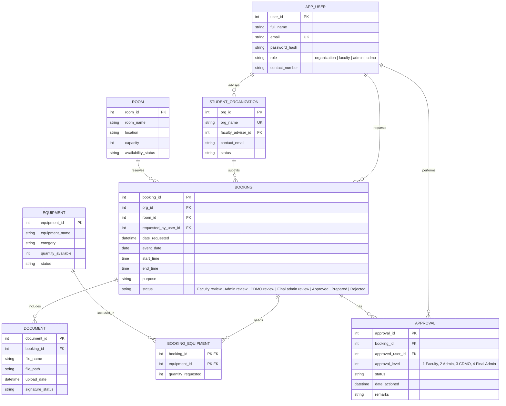

# Cardinal Resource Hub

Cardinal Resource Hub is a Mapúa University facility and equipment reservation system for organizations, faculty reviewers, administrators, and the CDMO.

## Repository Layout

```text
src/                 Active React application and shared styles
public/              Runtime assets, including the Mapúa logo
database/            Neon/PostgreSQL schema reference
README.md            Product, workflow, and database documentation
vite.config.ts       Vite development and production configuration
```

## Approval Flow

`Organization request → Faculty review → Admin review → CDMO review → Final Admin approval`

Admin performs the first operational review, the CDMO performs the fourth-stage review, and Admin makes the final approval decision.

### Existing Neon databases

Run [database/migrations/004_cdmo_approval_workflow.sql](database/migrations/004_cdmo_approval_workflow.sql) after the earlier migrations to replace the old Maintenance/Dean workflow with the CDMO workflow.

After deploying the booking workflow changes, run [database/migrations/001_booking_workflow.sql](database/migrations/001_booking_workflow.sql) once against the existing Neon database. It adds the idempotency key and document content type without removing existing bookings or files. Fresh databases should use [database/schema.sql](database/schema.sql).

For local development, set `DATABASE_URL` in `.env`, then run the API and website in separate terminals:

```bash
npm run api
npm run dev -- --host 0.0.0.0 --port 5173
```

Open `http://localhost:5173`. The Vite server proxies `/api` requests to the API on port `3001`. Existing databases should also run [database/migrations/002_date_aware_availability.sql](database/migrations/002_date_aware_availability.sql) to prevent overlapping non-rejected room requests.

## In-app notifications

Run [database/migrations/003_in_app_notifications.sql](database/migrations/003_in_app_notifications.sql) once against an existing database. New requests and workflow changes appear in the notification bell for the organization and the next responsible role. Rejections include the reviewer’s reason.

## ERD Database Design

The following relational design is intended for Neon PostgreSQL. The executable reference schema is in [database/schema.sql](database/schema.sql).



### Role Responsibilities

| Role | Responsibility | Database authority |
| --- | --- | --- |
| Organization | Owns its account, submits event requests, and tracks bookings | Creates `BOOKING`, `DOCUMENT`, and `BOOKING_EQUIPMENT` records |
| Faculty | Reviews the organization submission and adviser documents | Creates level 1 `APPROVAL` records |
| Admin | Performs the first and final operational reviews | Creates level 2 and level 4 `APPROVAL` records |
| CDMO | Reviews requests after the first Admin approval | Creates level 3 `APPROVAL` records |